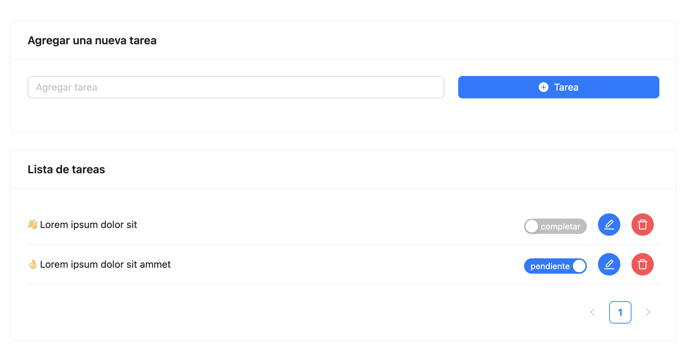

# Desafío Técnico - Edig



## Instalación

Instalar dependencias del proyecto Front.

```sh
npm install
```

Instalar dependencias del servidor dentro de la carpeta "backend"

```sh
npm install
```

## Configuración

En la carpeta "backend" agregar las credenciales de la base de datos MySql en el archivo ".env".

## Iniciar aplicación y servidor

Para iniciar la aplicación

La aplicación corre por defecto en el puerto: 5173
```sh
npm run serve
```

Para iniciar el servidor desde la caperta "backend"

El servidor corre por defecto en el puerto : 3000
```sh
npm run serve
```

